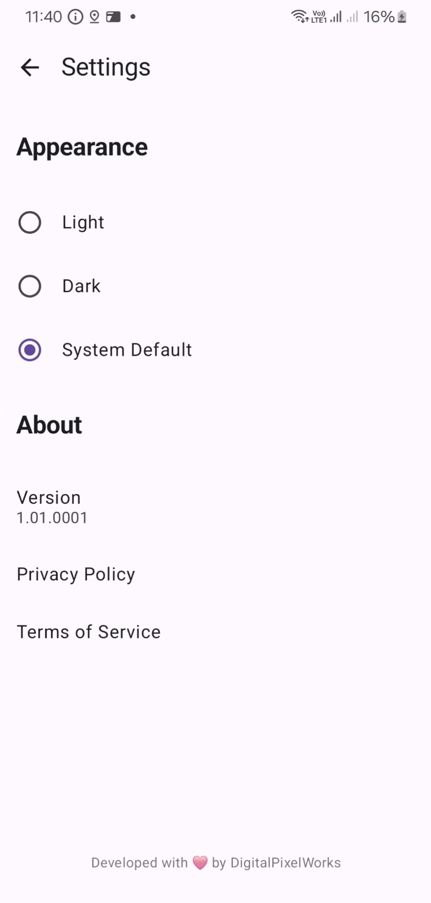

## Features ✨
- **Real-time monitoring** of CPU, RAM, battery, and sensors
- **Device analytics** with detailed hardware specs

## Preview 📸
<p>  
 

## Build Stats 📊


## Build Status 🔧
[](https://github.com/digitalpixelworks/pixelspec/actions/workflows/main.yml)

## Installation 📦
Download from:  
[](https://play.google.com/store/apps/details?id=io.android.pixelspec)  
[](https://github.com/digitalpixelworks/pixelspec/releases)

## Usage 🛠️
1. Open the app to view **real-time device stats**
2. Navigate tabs for detailed breakdowns:
    - 📊 **Performance** (CPU/RAM usage)
    - 🔋 **Battery** (Health/temperature)
    - 🌡️ **Thermals** (Sensor data)
    - etc.

## Privacy & Security 🔒
- **No data collection** - All processing happens locally
- Full policies:
    - [Privacy Policy](https://github.com/digitalpixelworks/pixelspec/blob/main/privacy_policy.md)
    - [Terms of Service](https://github.com/digitalpixelworks/pixelspec/blob/main/terms_of_service.md)

## Build Locally 🏗️
```bash
git clone https://github.com/digitalpixelworks/pixelspec.git  
cd pixelspec  
./gradlew assembleDebug  
```

## Contributing 🤝
PRs welcome! Feel free to fork and submit changes.

Developed with ❤️ by DigitalPixelWorks